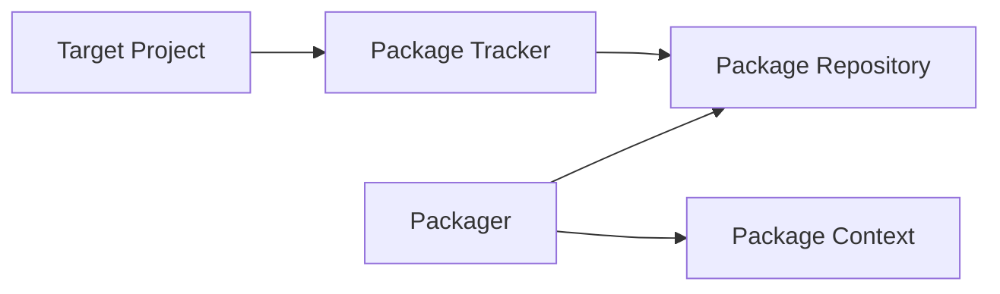

# System level architecture

This document describes all components of BacPack system and how they work together.

## Components

In a nutshell, BacPack system contains these components:

 - Packager
 - Package Repository
 - Package Context
 - Package Tracker
 - target project

The links between components are shown on next graph:

### Packager

Packager is a tool for building Docker Images, Packages and Apps. It takes a Package Context as an
input.

The `build-image` command of Packager builds Docker Image defined in Package Context.

Both `build-package` and `build-app` commands builds Package or App specified in Package Context
in a Docker container based on existing Docker image (built by `build-image` command), make an
zip archive of its file and copies it to Package Repository.

### Package Repository

Package Repository is a Git repository of Packages and Apps, which are built and copied there by
Packager.

### Package Context

Package Context contains definition of Docker images, Packages and Apps in a strict directory
structure (this structure is defined in Packager documentation). The Packages and Apps must use
Docker images defined in the same Package Context.

### Package Tracker

Package Tracker defines CMake macros for downloading, caching and populating Packages/Apps from
Package Repository. The target application has a link to Package Tracker repo to use Packages built
in Package Repository.