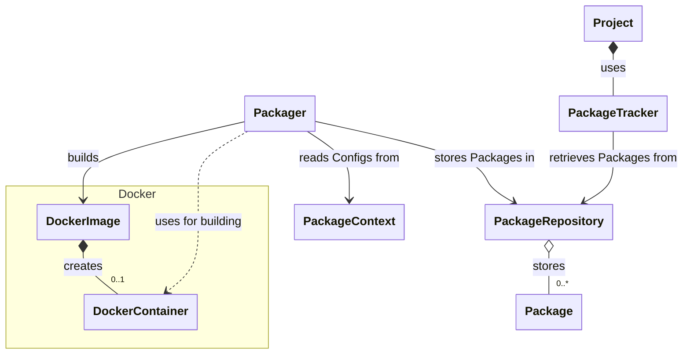
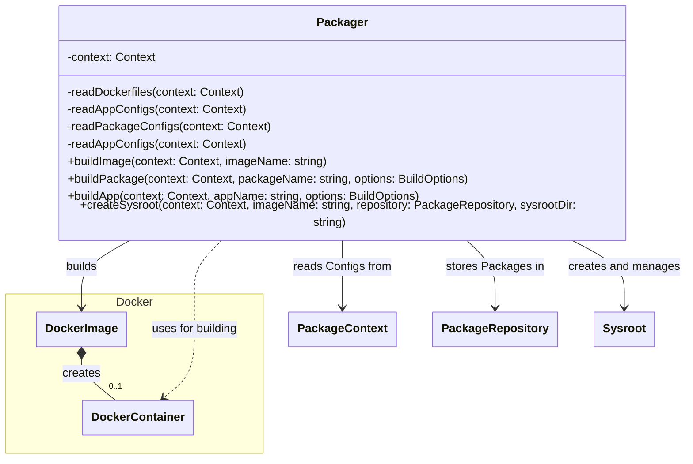
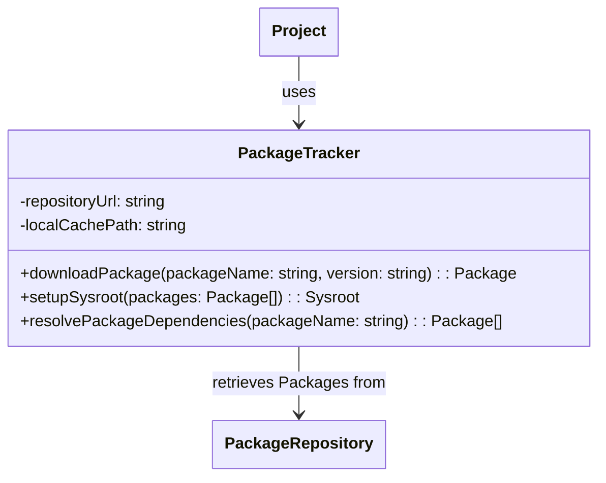
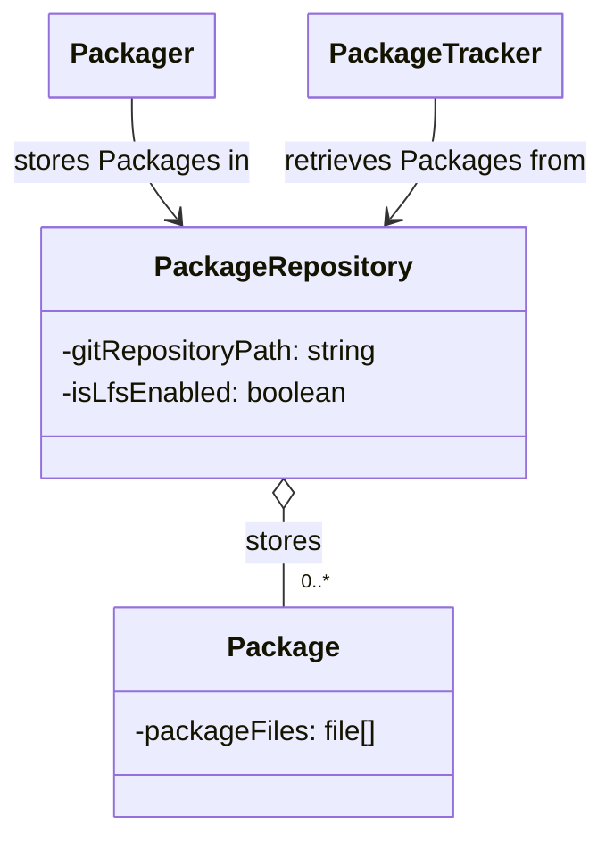
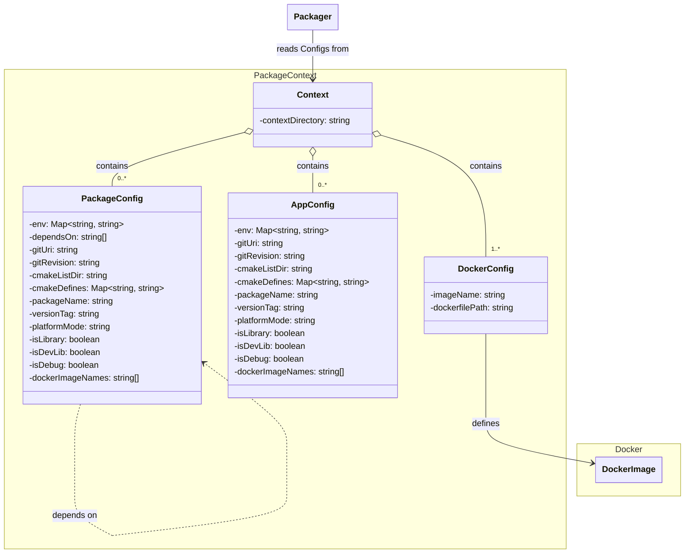

# System level architecture

This document describes all components of BacPack system and how they work together.

## Components

In a nutshell, BacPack system contains these components:

 - Packager
 - Package Repository
 - Package Context
 - Package Tracker
 - Project

The interactions and relationships between these components are shown on next diagram.

### Main components

#### Packager

Packager is a tool for building Packages and Apps. It takes a Package Context as an input.

Both `build-package` and `build-app` commands build Package or App specified in Package Context
in a Docker container based on existing Docker image built by `build-image` command, create a zip
archive of its files and copy it to Package Repository.

With `create-sysroot` command, Packager creates a sysroot directory from Packages in Package
Repository for given target platform.

#### Package Tracker

Package Tracker provides CMake macros that handle downloading, caching, and integrating
Packages/Apps from Package Repository. Projects link to Package Tracker repository to use Packages
built in Package Repository.

The Package Tracker links to a Package Repository. This link must be changed to work with project
specific Package Repository.

### Project specific components

#### Package Repository

Package Repository is a Git repository storage of Packages and Apps, which are built and copied
there by Packager.

#### Package Context

Package Context contains definitions of Docker images, Packages and Apps in a [strict directory
structure](https://github.com/bacpack-system/packager/blob/master/doc/ContextStructure.md). The
Packages and Apps must use Docker images defined in the same Package Context.

### External tools

#### cmakelib

Dependency tracking library for CMake. It defines macros for dependency tracking and features
caching for efficient use and building of dependencies.
