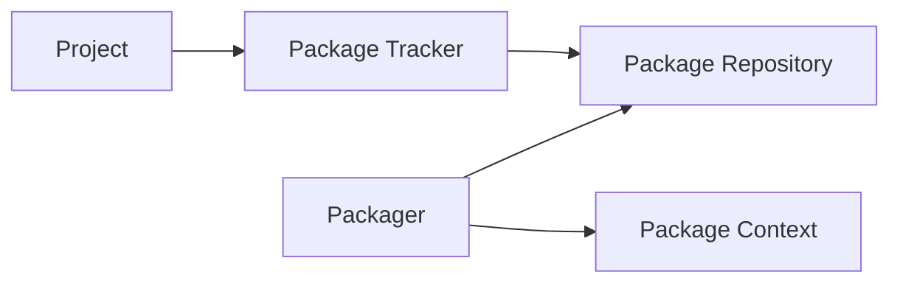

# System level architecture

This document describes all components of BacPack system and how they work together.

## Components

In a nutshell, BacPack system contains these components:

 - Packager
 - Package Repository
 - Package Context
 - Package Tracker
 - Project

The links between components are shown on next graph:

### Components

#### Packager

Packager is a tool for building Packages and Apps. It takes a Package Context as an input.

Both `build-package` and `build-app` commands builds Package or App specified in Package Context
in a Docker container based on existing Docker image built by `build-image` command, creates a
zip archive of its file and copies it to Package Repository.

#### Package Tracker

Package Tracker defines CMake macros for downloading, caching and populating Packages/Apps from
Package Repository. The project has a link to Package Tracker repo to use Packages built in Package
Repository.

The Package Tracker links to a Package Repository. This link must be changed to work with project
specific Package Repository.

### Project specific components

#### Package Repository

Package Repository is a Git repository of Packages and Apps, which are built and copied there by
Packager.

#### Package Context

Package Context contains definition of Docker images, Packages and Apps in a [strict directory
structure](https://github.com/bacpack-system/packager/blob/master/doc/ContextStructure.md).
The Packages and Apps must use Docker images defined in the same Package Context.

### External tools

#### cmakelib

Dependency tracking library for CMake. It defines macros for dependency tracking and features
caching for efficient use and building of dependencies.
