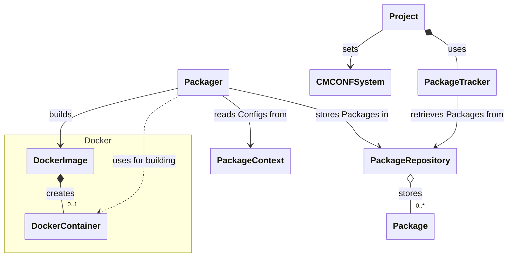
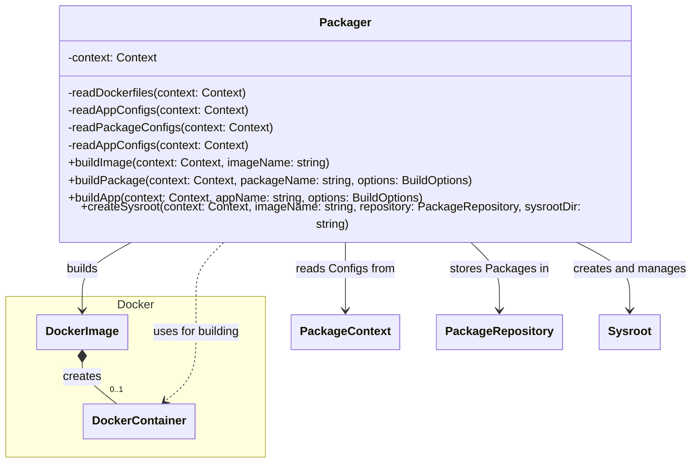
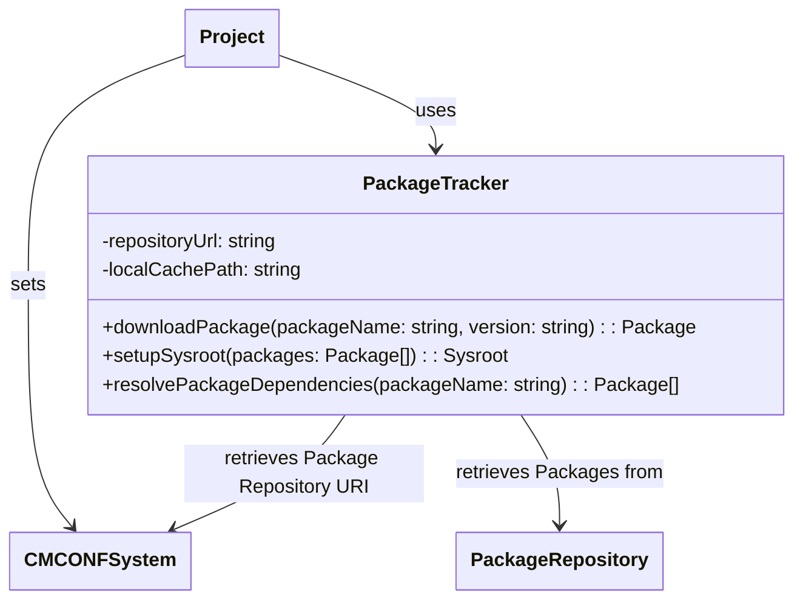
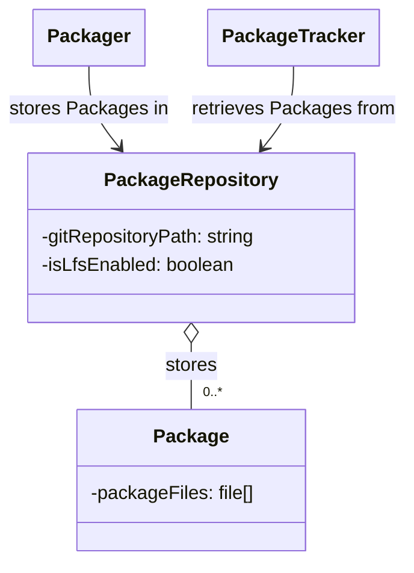
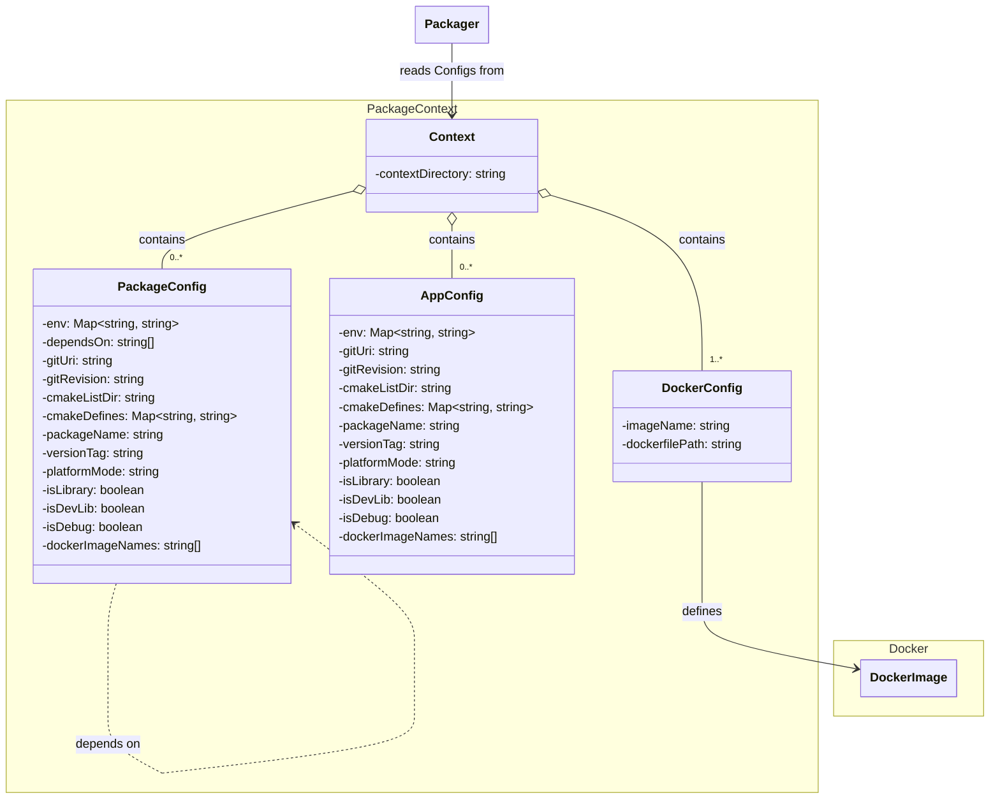
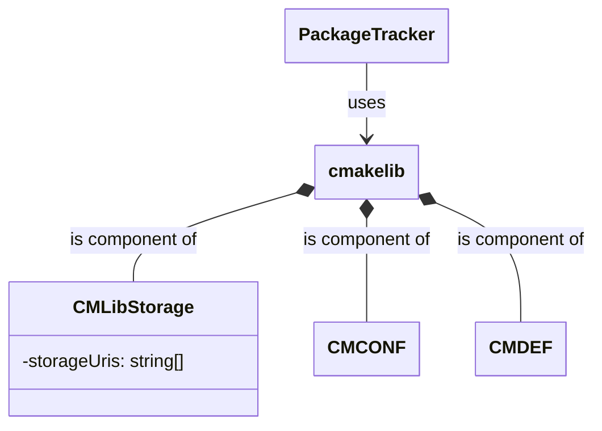
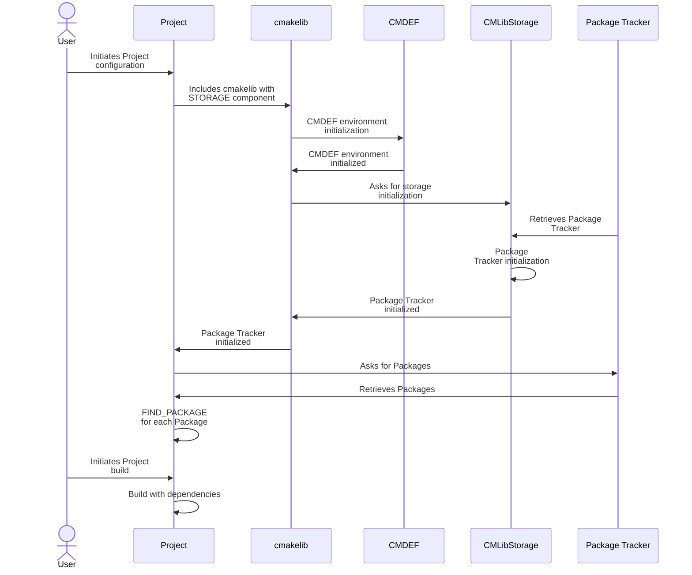

# System level architecture

This document describes all Components of BacPack system and how they work together.

## Components

In a nutshell, the BacPack system contains these Components:

 - Packager
 - Package Repository
 - Package Context
 - Package Tracker
 - Project
 - CMCONF system

The interactions and relationships between these Components are shown on next diagram.

```mermaid
---
  config:
    class:
      hideEmptyMembersBox: true
---
classDiagram
    class Packager
    class PackageContext

    namespace Docker {
        class DockerImage
        class DockerContainer
    }

    class PackageRepository
    class Package
    class Project
    class CMCONFSystem
    class PackageTracker

    %% CORE RELATIONSHIPS

    %% Packager uses PackageContext and PackageRepository (Association)
    Packager --> PackageContext : reads Configs from
    Packager --> PackageRepository : stores Packages in
  
    %% Packager builds DockerImage
    Packager --> DockerImage : builds

    %% PackageRepository aggregates Packages (Aggregation - packages are stored independently)
    PackageRepository o-- "0..*" Package : stores

    %% Docker relationships (Composition - container lifecycle tied to image)
    DockerImage *-- "0..1" DockerContainer : creates

    %% Packager creates packages through build process (Association)
    Packager ..> DockerContainer : uses for building

    %% EXAMPLE USAGE RELATIONSHIPS

    %% Project uses PackageTracker (Composition - Project owns its tracker)
    Project *-- PackageTracker : uses

    %% Project uses CMCONF system
    Project --> CMCONFSystem : sets

    %% PackageTracker interacts with repository and creates sysroot (Association)
    PackageTracker --> PackageRepository : retrieves Packages from
```

### Main Components

#### Packager

Packager is a tool for building Packages and Apps. It takes a Package Context as an input. It
supports both CMake and Meson build systems for building Packages.

Both `build-package` and `build-app` commands build Package or App specified in Package Context
in a Docker container based on existing Docker image built by `build-image` command, create a zip
archive of its files and copy it to Package Repository.

With `create-sysroot` command, Packager creates a sysroot directory from Packages in Package
Repository for given target platform.

```mermaid
---
  config:
    class:
      hideEmptyMembersBox: true
---
classDiagram
    class Packager {
      -context: Context
      -readDockerfiles(context: Context)
      -readAppConfigs(context: Context)
      -readPackageConfigs(context: Context)
      -readAppConfigs(context: Context)
      +buildImage(context: Context, imageName: string)
      +buildPackage(context: Context, packageName: string, options: BuildOptions)
      +buildApp(context: Context, appName: string, options: BuildOptions)
      +createSysroot(context: Context, imageName: string, repository: PackageRepository, sysrootDir: string)
    }
    class PackageContext

    namespace Docker {
        class DockerImage
        class DockerContainer
    }

    class PackageRepository

    %% CORE RELATIONSHIPS

    %% Packager uses PackageContext and PackageRepository (Association)
    Packager --> PackageContext : reads Configs from
    Packager --> PackageRepository : stores Packages in
  
    %% Packager builds DockerImage
    Packager --> DockerImage : builds

    %% Docker relationships (Composition - container lifecycle tied to image)
    DockerImage *-- "0..1" DockerContainer : creates

    %% Packager creates packages through build process (Association)
    Packager ..> DockerContainer : uses for building

    %% Packager creates sysroot
    Packager --> Sysroot : creates and manages
```

#### Package Tracker

Package Tracker provides CMake macros that handle downloading, caching, and integrating
Packages/Apps from Package Repository. Projects link to Package Tracker repository to use Packages
built in Package Repository.

The Project which uses Package Tracker must set its CMCONF system, which sets among other things
the Package Repository URI, so the Package Tracker knows which Package Repository to use.

```mermaid
---
  config:
    class:
      hideEmptyMembersBox: true
---
classDiagram
  class PackageTracker {
        -repositoryUrl: string
        -localCachePath: string
        +downloadPackage(packageName: string, version: string): Package
        +setupSysroot(packages: Package[]): Sysroot
        +resolvePackageDependencies(packageName: string): Package[]
  }

  Project --> PackageTracker : uses
  Project --> CMCONFSystem : sets

  %% PackageTracker uses CMCONF system
  PackageTracker --> CMCONFSystem : retrieves Package Repository URI

  %% PackageTracker interacts with repository and creates sysroot (Association)
  PackageTracker --> PackageRepository : retrieves Packages from
```

### Project specific Components

#### Package Repository

Package Repository is a Git repository storage of Packages and Apps, which are built and copied
there by Packager.

```mermaid
---
  config:
    class:
      hideEmptyMembersBox: true
---
classDiagram
    class PackageRepository {
      -gitRepositoryPath: string
      -isLfsEnabled: boolean
    }
    class Package {
      -packageFiles: file[]
    }

    %% CORE RELATIONSHIPS

    %% Packager uses PackageRepository (Association)
    Packager --> PackageRepository : stores Packages in

    %% PackageRepository aggregates Packages (Aggregation - packages are stored independently)
    PackageRepository o-- "0..*" Package : stores

    %% EXAMPLE USAGE RELATIONSHIPS

    %% PackageTracker interacts with repository and creates sysroot (Association)
    PackageTracker --> PackageRepository : retrieves Packages from
```

#### Package Context

Package Context contains definitions of Docker images, Packages and Apps in a [strict directory
structure](https://github.com/bacpack-system/packager/blob/master/doc/ContextStructure.md). The
Packages and Apps must use Docker images defined in the same Package Context.

```mermaid
---
  config:
    class:
      hideEmptyMembersBox: true
---
classDiagram
    namespace PackageContext {
        class Context {
            -contextDirectory: string
        }

        class PackageConfig {
            -env: Map~string, string~
            -dependsOn: string[]
            -gitUri: string
            -gitRevision: string
            -cmakeListDir: string
            -cmakeDefines: Map~string, string~
            -packageName: string
            -versionTag: string
            -platformMode: string
            -isLibrary: boolean
            -isDevLib: boolean
            -isDebug: boolean
            -dockerImageNames: string[]
        }

        class AppConfig {
            -env: Map~string, string~
            -gitUri: string
            -gitRevision: string
            -cmakeListDir: string
            -cmakeDefines: Map~string, string~
            -packageName: string
            -versionTag: string
            -platformMode: string
            -isLibrary: boolean
            -isDevLib: boolean
            -isDebug: boolean
            -dockerImageNames: string[]
        }

        class DockerConfig {
            -imageName: string
            -dockerfilePath: string
        }
    }

    namespace Docker {
        class DockerImage
    }

    %% CORE RELATIONSHIPS

    %% Packager uses Context
    Packager --> Context : reads Configs from

    %% Context aggregates configuration files (Aggregation - Configs exist as files)
    Context o-- "0..*" PackageConfig : contains
    Context o-- "0..*" AppConfig : contains
    Context o-- "1..*" DockerConfig : contains

    %% Docker relationships (Composition - container lifecycle tied to image)
    DockerConfig --> DockerImage : defines

    %% Package dependencies (Dependency)
    PackageConfig ..> PackageConfig : depends on
```

#### CMCONF system

The CMCONF system is a global configuration that specifies configuration needed by Package Tracker.
It uses the [CMCONF](https://github.com/cmakelib/cmakelib-component-cmconf) component of cmakelib.

Projects must use this system in order to access Packages from the Package Repository.

### External tools

#### cmakelib

Dependency tracking library for CMake. It defines macros for dependency tracking and features
caching for efficient use and building of dependencies.

It has several components, which can be used independently or together. Each component provides
specific functionality and has its own git repository. The components are:

 - [CMDEF](https://github.com/cmakelib/cmakelib-component-cmdef) - adds wrappers for basic CMake
 features
 - [CMUTIL](https://github.com/cmakelib/cmakelib-component-cmutil) - Provides functionality for
 other cmakelib components
 - [STORAGE](https://github.com/cmakelib/cmakelib-component-storage) - mechanism for storing and
 retrieving CMake dependencies
 - [CMCONF](https://github.com/cmakelib/cmakelib-component-cmconf) - global configuration system
 for CMake projects

The links between cmakelib and other Components are shown on next diagram.

```mermaid
---
  config:
    class:
      hideEmptyMembersBox: true
---
classDiagram
    class cmakelib
    class CMLibStorage {
        -storageUris: string[]
    }
    class PackageTracker

    %% PackageTracker uses CMLibStorage (Association)
    PackageTracker --> cmakelib : uses

    %% CMLibStorage uses cmakelib (Association)
    cmakelib *-- CMLibStorage : is component of

    cmakelib *-- CMCONF : is component of
    cmakelib *-- CMDEF : is component of
```

The interactions between cmakelib and other Components when building a Project are shown on next diagram.

```mermaid
sequenceDiagram
  actor User
  participant Project
  participant cmakelib
  participant CMDEF
  participant CMLibStorage
  participant Package Tracker

  User->>Project: Initiates Project<br>configuration
  Project->>cmakelib: Includes cmakelib with<br>STORAGE component
  cmakelib->>CMDEF: CMDEF environment<br>initialization
  CMDEF->>cmakelib: CMDEF environment<br>initialized
  cmakelib->>CMLibStorage: Asks for storage<br>initialization
  Package Tracker->>CMLibStorage: Retrieves Package<br>Tracker
  CMLibStorage->>CMLibStorage: Package<br>Tracker initialization
  CMLibStorage->>cmakelib: Package Tracker<br>initialized
  cmakelib->>Project: Package Tracker<br>initialized
  Project->>Package Tracker: Asks for Packages
  Package Tracker->>Project: Retrieves Packages
  Project->>Project: FIND_PACKAGE<br>for each Package
  User->>Project: Initiates Project<br>build
  Project->>Project: Build with dependencies
```