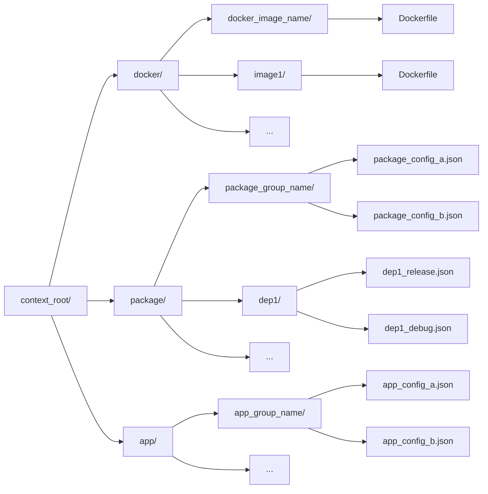

# Usage

This document shows all use cases defined in [Use Cases](./use_cases.md) on an example target
application which uses sample dependency - Package. Below are steps to build this dependency, put
it to the BringAuto Package repository and add it to target application.

## Define a Package

Our example application will use a Package named `dep1` as a dependency. This Package depends on
Package `dep2`. First we need to create a definition files of these Packages inside a Package
context. The structure of Package context is decribed more in Packager documentation, but there is
a basic example:



```plaintext
<context_directory>/
  docker/
    <docker_image_name>/
      Dockerfile
    ...
  package/
    <package_group_name>/
      <package_config_a>.json
      <package_config_b>.json
    ...
    dep1/
      dep1_release.json
      dep1_debug.json
    dep2/
      dep2_release.json
      dep2_debug.json
  app/
    <app_group_name>/
      <app_config_a>.json
      <app_config_b>.json
    ...
```

In a `docker` directory the Dockerfiles for each image name are defined. In a `package`/`app`
directory, the Package/App definition files are present. Each Package can have more variations,
that is why there is a concept of Package group in a structure. The `package_group_name` is the
actual name of our Package and in this directory there can be more variations of this Package. Both
Packages will have a release and debug variations. The example of files of our Package is shown in
the example context structure.

The example json definition of release variation of `dep1` Package is following:

```json
{
  "Env": {},
  "DependsOn": [
    "dep2"
  ],
  "Git": {
    "URI": "/path/to/dep1/repo",
    "Revision": "v1.0.0"
  },
  "Build": {
    "CMake": {
      "Defines": {
        "CMAKE_BUILD_TYPE": "Release"
      }
    }
  },
  "Package": {
    "Name": "dep1",
    "VersionTag": "v1.0.0",
    "PlatformString": {
      "Mode": "auto"
    },
    "IsLibrary": true,
    "IsDevLib": true,
    "IsDebug": false
  },
  "DockerMatrix": {
    "ImageNames": [
      "image1"
    ]
  }
}
```

All fields of json definitions (Config) are described in Packager documentation. Only important
fields for our use case will be described further. The `DependsOn` field contains all dependency
Packages which must be defined in the same context. The `Git/URI` must be a uri to a CMake based
git repository with tag specified by `Git/Revision`. In `Build/CMake/Defines` can be specified all
CMake options. The `Package/Name` field must be same as name of `package_group_name`. And all
images in `DockerMatrix/ImageNames` must be defined in `docker` directory of same context.

The debug variation of `dep1` Package will be very similar with changes of `CMAKE_BUILD_TYPE` and
`Package/IsDebug` flag. The `dep2` Package will be the same only with empty `DependsOn` array.

## Build a Package

After definition of Package `dep1` we can build it with Packager.

If the used image in our Package is not build on our system, it must be build with `build-image`
Packager command. The command for building `image1` image could be:

```bash
bap-builder build-image --context /path/to/package/context --image-name image1
```

The Packager command `build-package` for building Packages requires these parameters:

 - context
 - image-name
 - output-dir

The context is a path to the Package context, the image-name is a target image for Package and
output-dir is a path to the Package repository, which already can have built Packages or it can be
an empty Git repository.

We will put this Package to
[BringAuto's main Package repository](https://gitea.bringauto.com/fleet-protocol/package-repository").
We need to clone this repository, then the path to it can be given to Packager executable.

The command for building Package `dep1` is:

```bash
bap-builder build-package --context /path/to/package/context --image-name image1 --output-dir /path/to/package/repository --name dep1 --build-deps
```

This command builds a Package `dep1` defined in context for `image1` image, creates an archive
of this Package and copies it to the output-dir (Package repository). The command with
`--build-deps` flag also builds all dependencies of given Package. In our case it also builds the
`dep2` Package. More flags and settings of Packager are described in its documentation.

After the Package is in Package repository we can push it to origin.

## Include Package in an application

We have built a dependency Package `dep1` and put it to remote BringAuto's Package repository. Now
we can use this Package in a CMake based application.

First we need to have cmakelib (link in [Introduction](./index.md)) installed on our system.

In the application root directory we need to add `CMLibStorage.cmake` with following content:

```cmake
SET(STORAGE_LIST DEP)
SET(STORAGE_LIST_DEP "https://github.com/bacpack-system/package-tracker.git")
```

This will links the application with BringAuto's Package tracker. This enables adding Packages from
BringAuto's Package repository (The Package tracker points to Package repository).

Then the dependencies must be defined in `cmake/Dependencies.cmake` like that:

```cmake
BA_PACKAGE_LIBRARY(dep1 v1.0.0)
```

This file must be included in application's CMakeLists.txt and then the Package can be included
with `FIND_PACKAGE`. Example CMake code:

```cmake
LIST(APPEND CMAKE_MODULE_PATH "${CMAKE_SOURCE_DIR}/cmake")
FIND_PACKAGE(dep1 1.0.0 REQUIRED)
```

More info about the macros is in Package tracker repository.
