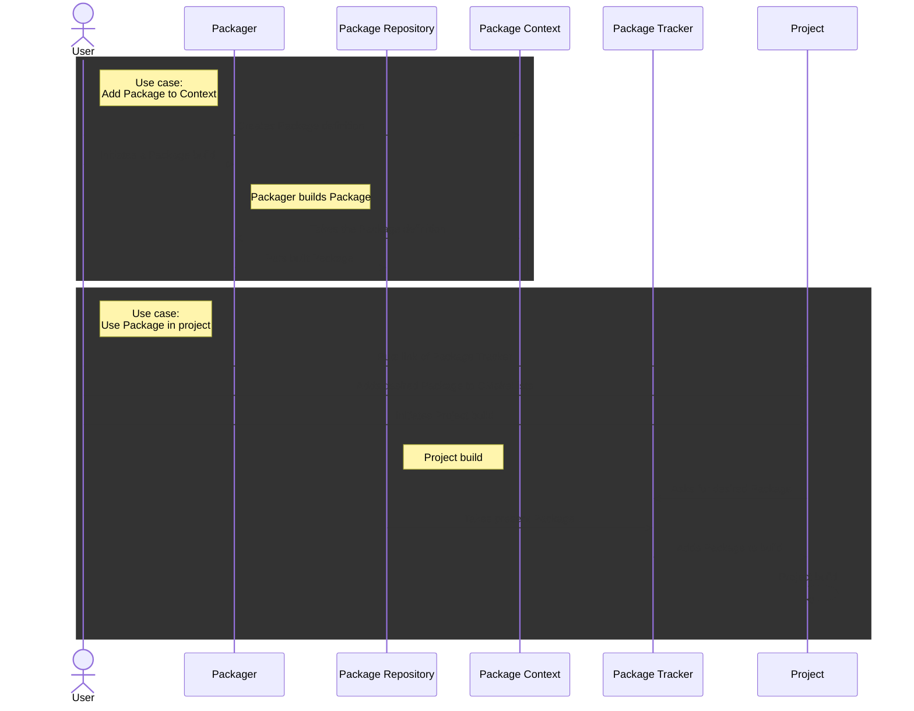

# Use cases

This document describes several use cases for the BacPack System. All these use cases are described
further in [Usage](./example_usage.md).

The following sequence diagram illustrates data flow and interactions between user and BacPack
components for listed use cases.

## Add Package to Package context

After adding a Package Config to Package Context, the Package can be built by Packager and hosted
in a Package Repository. The Package can then be easily added to projects by including it in
CMakeLists.

## Use already built Packages in my CMake based project

To use a Package that was built with Packager and uploaded to a Package Repository, use Package
Tracker macros to add this Package to the application. The Package Tracker repository URL must also
be set in `CMLibStorage.cmake` in the root directory of the application.
