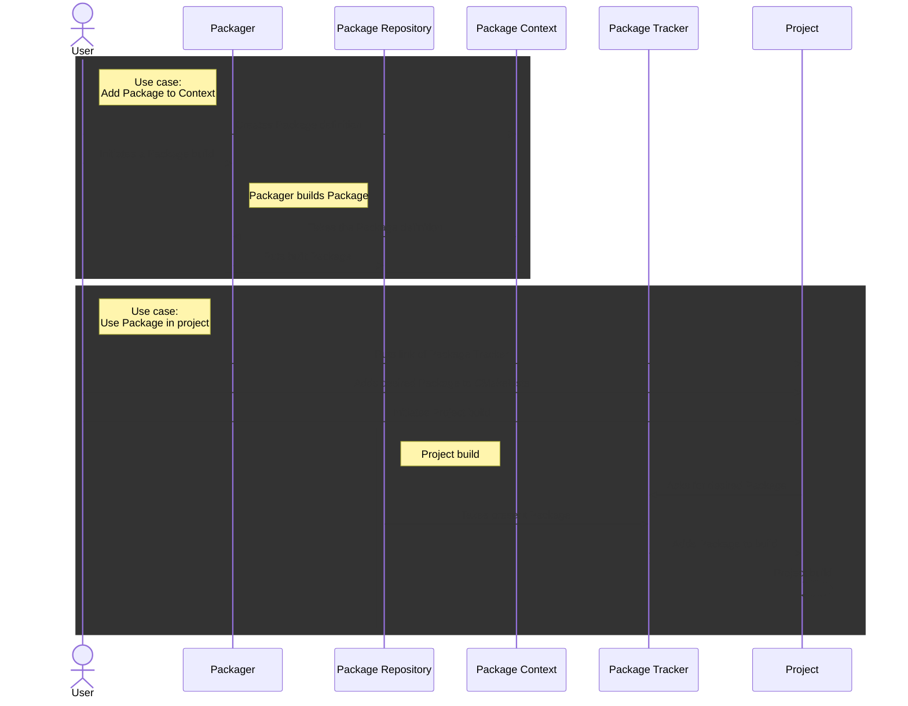

# Use cases

There are several use cases how to use BacPack system, which will be described in this document.
All these use cases are described further in [Usage](./example_usage.md).

The change of data and actions between user and BacPack components shows following sequence diagram.

## Add Package to Package context

If you want to take an advantage of BacPack system dependency management, you can consider adding
a Package to Package Context. This Package can be build by Packager and hosted in a Package
Repository. Then you can easily add the Package to your project by adding it in a CMakeLists.

## Use already built Packages in my CMake based project

If you want to use a Package which was built with Packager and is uploaded in a Package Repository,
you need to use a Package Tracker macros to add this Package to your application. You also need to
set Package Tracker repo url in `CMLibStorage.cmake` in the root directory of your application.
