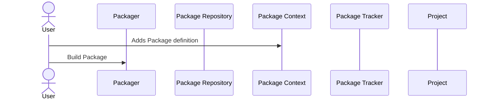
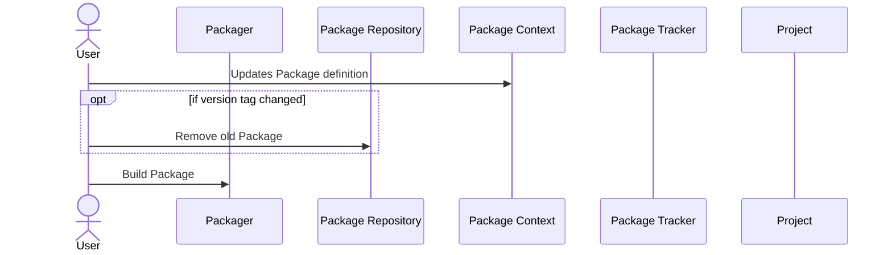
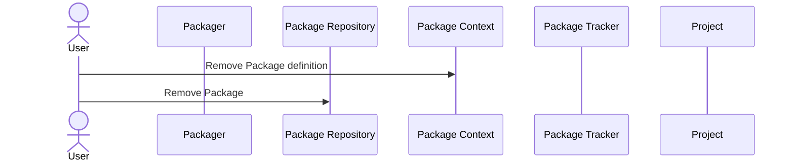
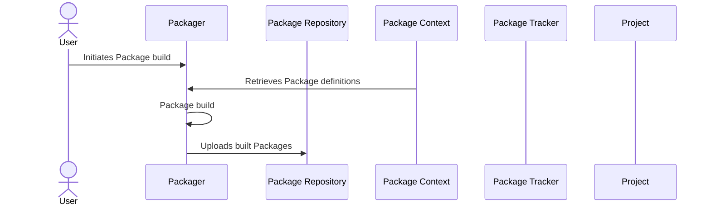
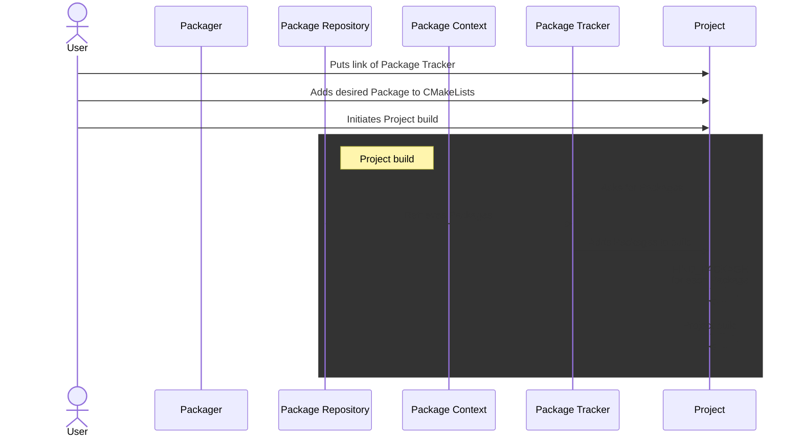

# Use cases

This document describes several use cases for the BacPack System. Some of these use cases are
described further in [Usage](./example_usage.md).

## Package Context Management

This section describes use cases related to managing a Package Context. After adding and updating
a Package, the Package should be built, which is described in [Build a Package from Package
Context](#build-a-package-from-package-context) use case.

### Add Package

After adding a Package Config to Package Context, the Package can be built by Packager and hosted
in a Package Repository. The Package can then be easily added to projects by including it in
CMakeLists.

### Update Package

Updating a Package means changing the Package Config in Package Context and then rebuilding the
Package. Changing the version tag also requires removing the old version Package from the
Package Repository before building the new version.

### Remove Package

Removing a Package from Package Context means removing the Package Config from Package Context
and then removing the Package from the Package Repository.

## Build a Package from Package Context

The Packager is used to build Packages/Apps from Package Context. The built Packages are then
uploaded to a Package Repository. The Packages in Package Context form a dependency trees, therefore
Packager supports several ways how to build the Packages:
 - build single Package
 - build single Package with its dependencies
 - build all Packages which depends on a Package
 - build all Packages in Package Context

These use cases are described in detail in
[Packager documentation](https://github.com/bacpack-system/packager/blob/master/doc/UseCaseScenarios.md).

## Use already built Packages in CMake based project

To use a Package that was built with Packager and uploaded to a Package Repository, use Package
Tracker macros to add this Package to the application. The Package Tracker repository URL must also
be set in `CMLibStorage.cmake` in the root directory of the application.

